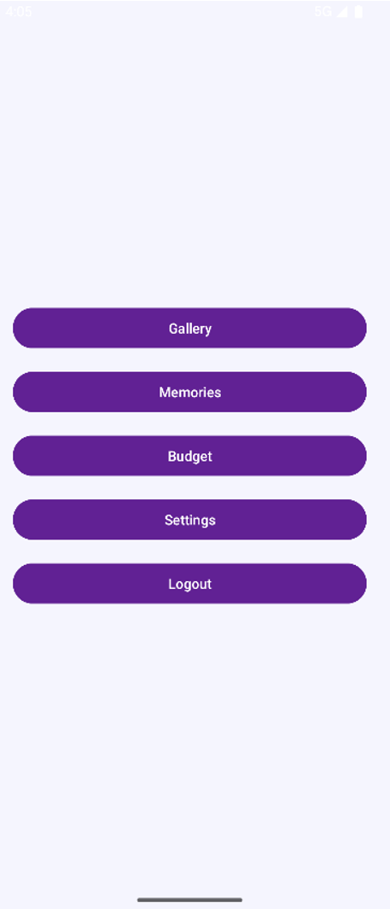
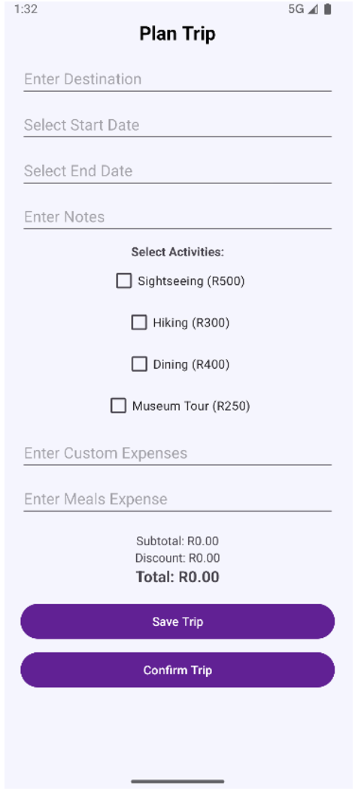
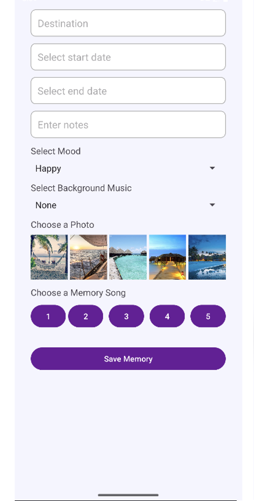
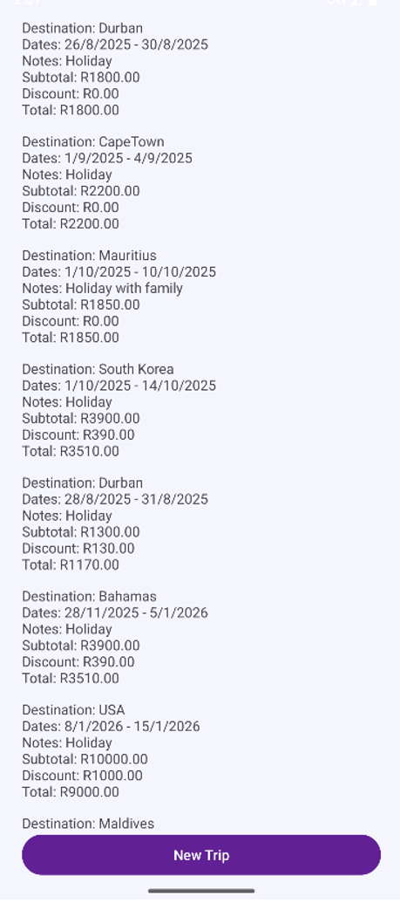

# TripBuddy – Android Travel Planner

TripBuddy is an Android travel planning application developed to help users organise and manage their trips in one place. The application combines trip planning, budgeting, travel memories and local data storage in a user-friendly mobile interface.

## Features

- User login and session management

- Trip planning and travel detail management

- Trip budgeting

- Travel photo gallery

- Travel memories with audio playback

- Trip summary

- Settings and application management

- Local data storage

- Loyalty and reward functionality

- User-friendly Android interface

## Screenshots

### Splash Screen

### Login

### Welcome

### Dashboard

### Budget

### Gallery

### Memories

### Settings

### Trip Summary

## Technologies Used

- **Java** – Application development

- **Android Studio** – Development environment

- **XML** – User interface layouts

- **SQLite** – Local database storage

- **SharedPreferences** – Persistent user and session data

- **RecyclerView** – Gallery implementation

- **Git and GitHub** – Version control

## Application Structure

The application uses multiple Android activities to separate different areas of functionality, including:

- Login

- Welcome

- Home Dashboard

- Budget

- Gallery

- Memories

- Summary

- Settings

The project also uses helper classes for database management, session management, image handling and rewards functionality.

## Software Engineering Concepts

This project demonstrates practical application of:

- Object-Oriented Programming (OOP)

- Android Activity Lifecycle

- Local database management

- Persistent data storage

- User interface and UX design

- Application navigation

- Modular application structure

## Project Purpose

TripBuddy was developed as part of my Bachelor of Science in Information Technology studies at Eduvos. The project provided practical experience in designing and developing an Android application while applying software engineering, database and mobile application development concepts.

## Key Learning Outcomes

Through this project, I gained practical experience in:

- Developing Android applications using Java

- Designing interfaces using XML

- Working with SQLite databases

- Managing persistent application data

- Implementing Android activities and navigation

- Creating reusable application components

- Applying software engineering principles to a functional application

## Developer

**Kayla Abdul Ganie**

BSc Information Technology – Software Engineering  

Eduvos

GitHub: [@kayla014](https://github.com/kayla014)
kayla014 - Overview
BSc IT (Software Engineering) Student at Eduvos | Software Engineering Student - kayla014
 
